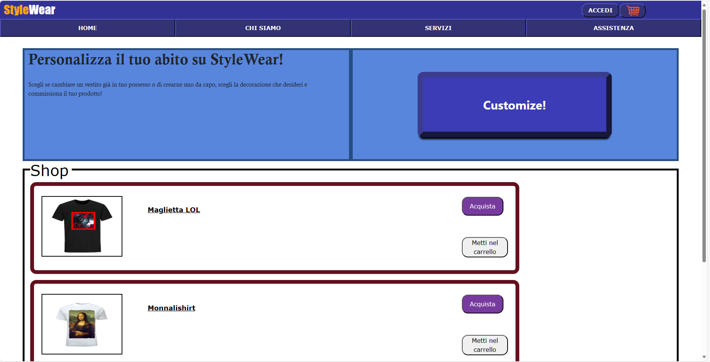
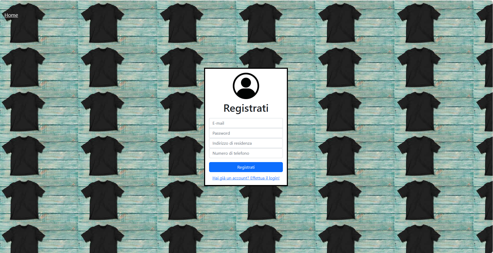
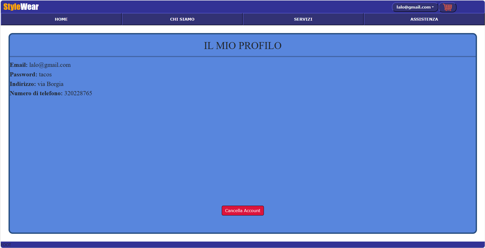
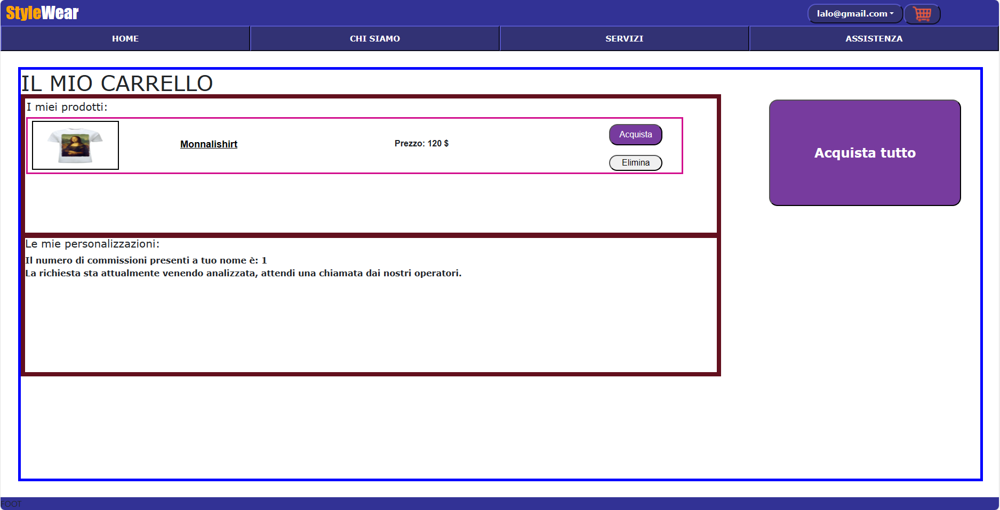
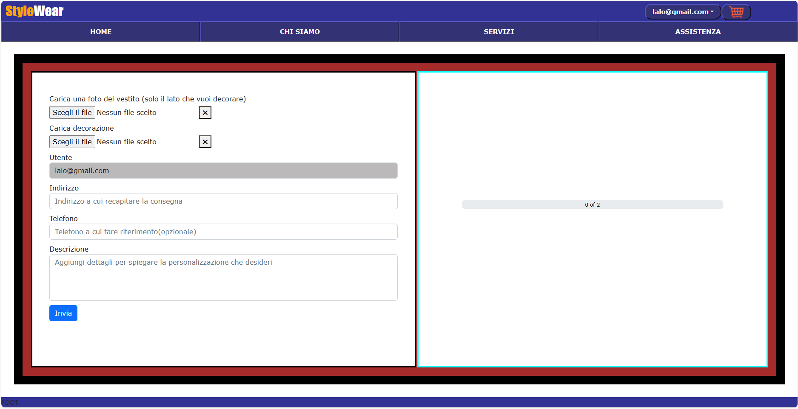
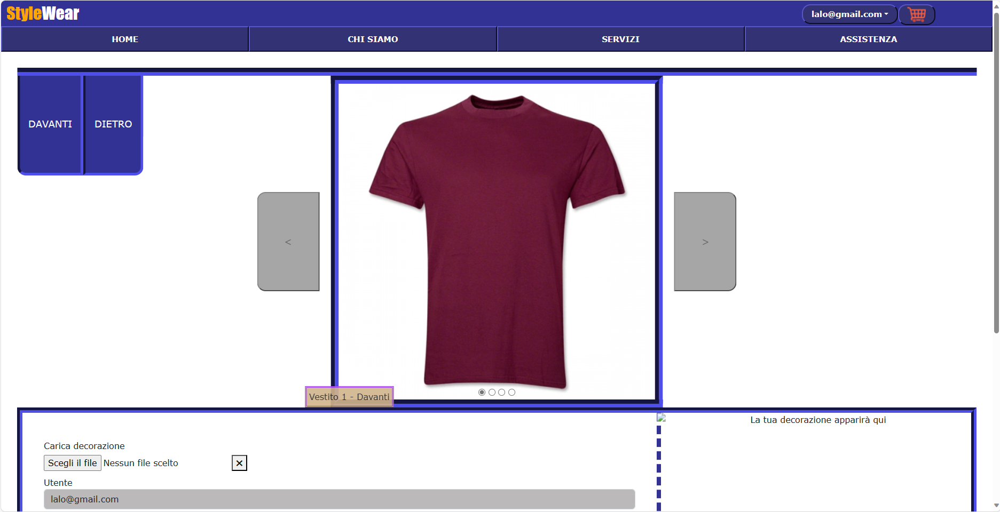

# Progetto-LTW-StyleWear
 A website for a fictional eshop capable of customizing t-shirts
# Explanation
This is a university project made in collaboration with Stefano Moisuc. There's a small database in postgreSQL (also with the default available t-shirts) as seen by the SQL files. Everything else of note is inside the pdf document. 
The project was created for the exam of "Languages and Technologies for the Web", external course of the third year of Computer Engineering at La Sapienza university of Rome. The pdf is in italian.

Homepage of the website (With more shirts to buy in the shop)

Registration page

Profile page

Cart page

Section to customize your own clothes

Sections to customize template clothes

